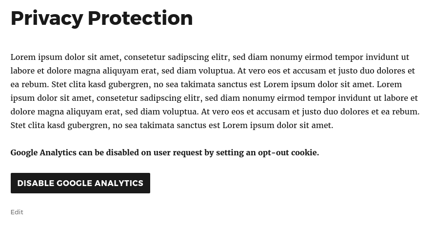

Disable Analytics by Opt-Out
==================================================



## Google Analytics ##

### Shortcode ###

To display the button, just add the `googleanalytics-optout` to your content, e.g. in your privacy policy.

```
Lorem ipsum dolor sit amet, consetetur sadipscing elitr, sed diam nonumy eirmod tempor invidunt ut labore et dolore magna aliquyam erat, sed diam voluptua. At vero eos et accusam et justo duo dolores et ea rebum. Stet clita kasd gubergren, no sea takimata sanctus est Lorem ipsum dolor sit amet. 

[googleanalytics-optout]
```

### Custom Text ###

You can customize the button text by setting the in/out attributes.

* **in** Visible if Google Analaytics is enabled
* **out** Visible if Google Analaytics has been disabled

```raw
[googleanalytics-optout in="Google Analytics is enabled. Click here to disable it." out="Google Analytics has been disabled"]
```

### Styling ###

The button is realized as HTML5 `<button>` element and uses your websites default styles. 
You can change the styles by using the button-id attribute as selector `#tweakr-ga-optout`

```css
/* Default Button Styles */
#tweakr-ga-optout{
    color: #f0f0f0;
    background-color: #101010;
    font-weight: bold;    
}

/* Class tweakr-ga-out is added in case the opt-out cookie has been set */
#tweakr-ga-optout.tweakr-ga-out{
    background-color: #00c010;
}
```

## PIWIK ##

### Shortcode ###

To display the button, just add the `piwikanalytics-optout` to your content, e.g. in your privacy policy.

```
Lorem ipsum dolor sit amet, consetetur sadipscing elitr, sed diam nonumy eirmod tempor invidunt ut labore et dolore magna aliquyam erat, sed diam voluptua. At vero eos et accusam et justo duo dolores et ea rebum. Stet clita kasd gubergren, no sea takimata sanctus est Lorem ipsum dolor sit amet. 

[piwikanalytics-optout]
```

### Custom Text ###

You can customize the button text by setting the in/out attributes.

* **in** Visible if Piwik Analaytics is enabled
* **out** Visible if Piwik Analaytics has been disabled

```raw
[piwikanalytics-optout in="Piwik Analytics is enabled. Click here to disable it." out="Piwik Analytics has been disabled"]
```

### Styling ###

The button is realized as HTML5 `<button>` element and uses your websites default styles. 
You can change the styles by using the button-id attribute as selector `#tweakr-piwik-optout`

```css
/* Default Button Styles */
#tweakr-piwik-optout{
    color: #f0f0f0;
    background-color: #101010;
    font-weight: bold;    
}

/* Class tweakr-piwik-out is added in case the opt-out cookie has been set */
#tweakr-piwik-optout.tweakr-piwik-out{
    background-color: #00c010;
}
```
